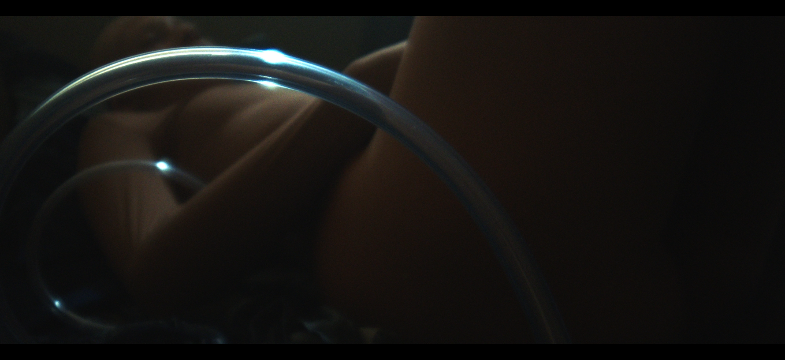
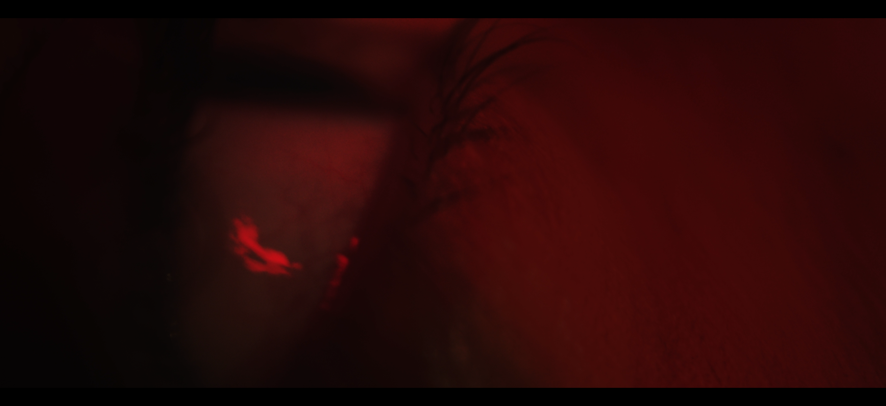
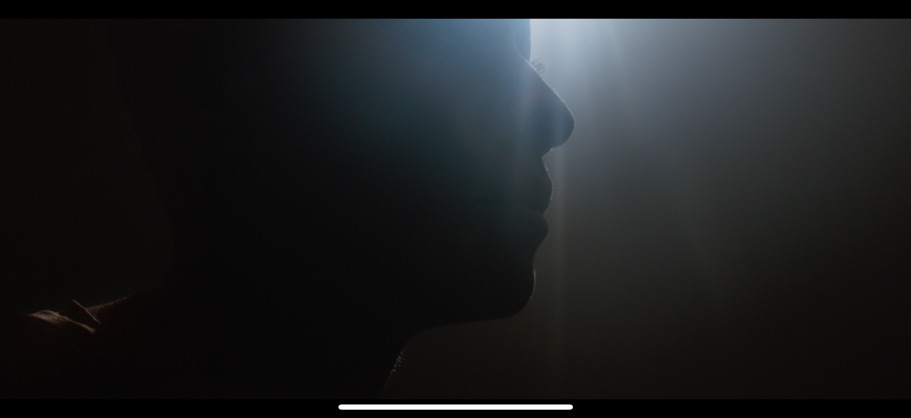
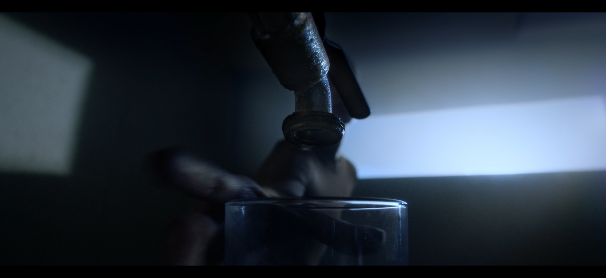
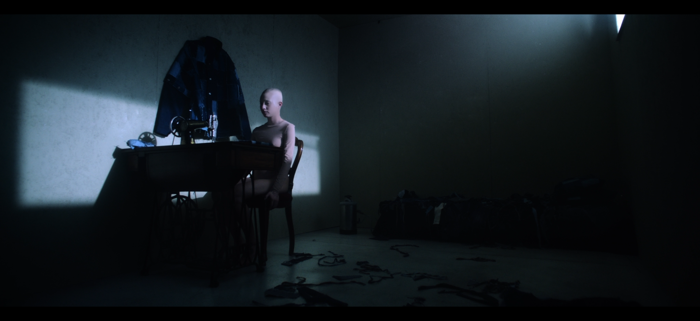
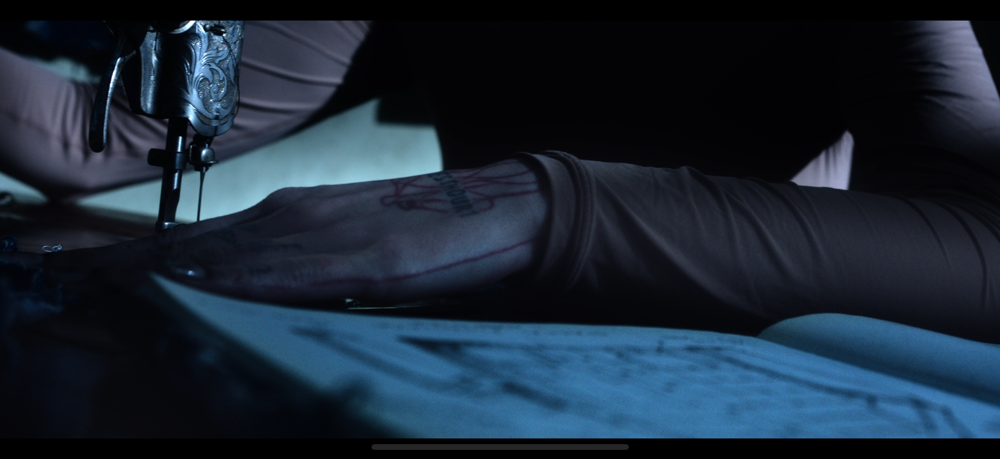

# Design Brief — Non Sprecarlo

Sito web per il cortometraggio **Non Sprecarlo** di Salvatore Sardu (Salvatore Sardu Films).
Repo: `https://github.com/21badore/non-sprecarlo` · Stack: Next.js 14 + TypeScript + Tailwind CSS

---

## 1. Il film

- **Titolo**: Non Sprecarlo
- **Regia**: Salvatore Sardu
- **Anno**: 2026
- **Durata**: 5 minuti
- **Formato**: 2,39:1 (anamorfico)
- **Genere**: cortometraggio sci-fi / distopico / sperimentale

**Sinossi**:
> Anno 2984. Il mondo sta finendo. Per davvero. Infatti stavolta non ci sono previsioni.
> Un essere, che di umano ha poco, vive nel suo loculo, dove nasce, muore e produce
> con quei pochi scarti che le vecchie generazioni hanno lasciato sulla terra.
> Parla con se stesso perché è l'unica compagnia possibile. Anche se la sua voce non è sola.

**Tono**: intimo, claustrofobico, post-apocalittico ma sobrio. Cinema indipendente di ricerca.

**Brand sostenitori**: Weave · Moviepeople · SCPT

---

## 2. Cosa è stato fatto finora

Sito **one-page con 3 sezioni full-screen a scorrimento**, più una pagina `/news` per l'archivio aggiornamenti.

### Le 3 sezioni della home
1. **`#film` — NON SPRECARLO**
   - Hero, titolo gigante spezzato (`Non` in alto-sx, `Sprecarlo` enorme al fondo)
   - Sinossi nel centro, ancorata alla zona inferiore
   - CTA testuale "Guarda il corto →" + meta (5' · Regia di S. Sardu)
   - Background: still `film-04` (rubinetto, mano, bicchiere)

2. **`#produzione` — DIETRO LE QUINTE**
   - Titolo spezzato `Dietro / le quinte`, allineato a destra, motion staggered
   - Breve testo sulla produzione
   - Scheda tecnica (anno · durata · formato · regia)
   - Menzione brand sponsor
   - Background: still `film-02` (atmosferico rosso)

3. **`#aggiornamenti` — PROSSIMAMENTE**
   - Titolo spezzato `Prossima / mente`, motion staggered
   - Form newsletter (Resend API, già funzionante)
   - Lista ultime 3 news (MDX in `/content/news/`)
   - Link archivio completo `/news`
   - Background: still `film-05` (campo lungo: figura alla macchina da cucire)

### Altre pagine
- `/news` — archivio cronologico delle news, sfondo crema piatto
- `/news/[slug]` — singola news renderizzata da MDX

### Componenti riutilizzabili
- `<Header>` — sticky, trasparente sopra le foto, opaco crema dopo lo scroll
- `<Footer>` — minimale, fondo scuro
- `<Section>` — wrapper sezione full-screen con background image, gradiente di leggibilità configurabile (`fadeHeight`), variante `bottom` o `right`
- `<Reveal>` — wrapper con Intersection Observer per fade-in + slide-up al scroll
- `<NewsletterForm>` — form Resend (subscribe) con stati loading/success/error/duplicate

---

## 3. Sistema di design già in uso

### Palette
| Ruolo | Colore | Note |
|-------|--------|------|
| Background pagina | `#F5EFE6` (crema caldo) | base delle pagine `/news` |
| Testo scuro | `#1A1612` (nero caldo) | su fondo crema |
| Accent | `#C75D3D` (terracotta) | hover, link, bottone newsletter |
| Overlay foto | `rgba(15,10,7,0.x)` | gradienti di leggibilità sulle hero |
| Testo su foto | `#FFFFFF` | con opacità 0.85–0.95 per ammorbidire |

### Tipografia
- **Font**: **Futura** (sistema, su Mac/iOS) → fallback **Jost** (Google Fonts, clone Futura)
- **Mono**: rimosso, un solo font per tutto il sito (differenziato da size + tracking + uppercase)
- **Pesi attivi**: `500` (Medium) per body / eyebrow / nav, `700` (Bold) per titoli e CTA
- **Tracking**:
  - Titoli grandi: `-0.04em` / `-0.05em` (tight)
  - Eyebrow / mono labels: `0.25em` / `0.3em` (wide), uppercase

### Motion
- Solo fade-in + slide-up subtle (32px, easing `cubic-bezier(0.22,1,0.36,1)`, 1100ms)
- Stagger via `delay-1`/`delay-2`/`delay-3` (200ms increments)
- `prefers-reduced-motion` rispettato (animazioni disabilitate)
- **Niente hover decorativi**, niente parallax, niente carousel

### Layout principles
- 3 sezioni full-screen `min-h-screen`
- Foto come sfondo, gradiente verticale (o laterale) per leggibilità
- Testo ancorato in basso o asimmetrico
- Titoli **spezzati** su 2 righe con offset orizzontale per creare diagonale editoriale
- `display: contents` su `<h1>` per mantenere semantica corretta nonostante lo split visivo

---

## 4. Risorse disponibili

### Foto (in `public/images/film/`)
6 still del film, tutti **2622×1206 PNG** (aspect ratio 2.17:1), peso 1.8–3 MB ciascuno.

#### `film-01.png` — Tubo di vetro su torso
Punti focali: curva del tubo (sx), riflesso luminoso. Atmosfera blu/scura, intima.


#### `film-02.png` — Atmosfera rossa, occhio/ciglia
Punti focali: occhio (centro-sx), macchia rossa (basso-sx). Astratto, viscerale.


#### `film-03.png` — Silhouette di profilo controluce
Punti focali: volto/profilo (centro), luce dx. Cinematografico, epico.


#### `film-04.png` — Rubinetto, mano, bicchiere
Punti focali: rubinetto (alto-dx), mano (basso-sx), bicchiere (basso-centro). Composizione complessa, narrativa.


#### `film-05.png` — Stanza in penombra, figura alla macchina da cucire
Punti focali: figura (sx-centro), finestra (sx alta), pavimento con scarti. **Campo lungo iconico**, ottimo per hero.


#### `film-06.png` — Close-up del braccio durante la lavorazione
Punti focali: pistola/macchina (alto-sx), braccio orizzontale, tatuaggio rosso. Intenso, processuale.


### Trailer
Da inserire come URL Vimeo (placeholder attuale: `https://vimeo.com/000000000`). **Niente embed sul sito** — solo link testuale che apre il video esterno (decisione del cliente).

### News
3 esempi MDX in `/content/news/` (frontmatter: `title`, `date`, `excerpt`). Aggiungerne altre: basta creare nuovo file `.mdx`.

---

## 5. Cosa potrebbe essere migliorato

> Aree libere in cui la designer/il designer può proporre.

### Critiche aperte
1. **Sovrapposizione testo/foto** — i titoli giganti coprono sempre qualche parte saliente delle immagini, anche con gradienti. Possibili soluzioni alternative da esplorare:
   - Mix-blend-mode (`difference`/`exclusion`) sul titolo
   - Layout a due colonne netto (foto sx / testo dx)
   - Foto come "card" con margine + colore di sfondo della pagina visibile attorno
   - Usare crop/zoom diversi (es. `object-fit: contain` con padding)

2. **Il titolo "Non Sprecarlo" spezzato in 2** può sembrare troppo ardito o poco leggibile per chi non conosce il film. Da valutare:
   - Mantenere lo split ma aggiungere un piccolo prompt visivo
   - Tornare a riga unica con scala più piccola
   - Versione mobile: ha senso lo split? O è meglio compattare?

3. **Identità visiva** — l'accento terracotta `#C75D3D` è stato scelto da me come placeholder. Il regista non ha ancora un brand color ufficiale. Da definire o confermare.

4. **Navigation** — l'header sticky con 3 voci ha senso, ma su scroll passa da trasparente a crema: questa transizione è ottimizzabile? Vale la pena un menu hamburger anche desktop?

5. **Trattamento "PROSSIMAMENTE"** — la sezione 3 è la più piena (form + lista news + CTA). Potrebbe essere riprogettata per non sentirsi "appiccicata" al resto.

6. **Locandina/poster ufficiale del film** — non ce l'abbiamo. Sarebbe utile averne una versione (sia per la home che per Open Graph SEO).

7. **Tipografia secondaria** — abbiamo un solo font (Futura) per tutto. Se il designer vuole introdurre un secondo font (es. un serif per la sinossi, per dare contrasto), è benvenuto.

### Aree dove invece NON cambiare
- **Stack tecnico**: Next.js 14 + Tailwind. Niente shadcn/ui o librerie pre-stilizzate.
- **Newsletter**: integrazione Resend già funzionante.
- **MDX per le news**: gestione manuale via file (no CMS).
- **Italiano**: tutto il copy in italiano.
- **Niente tracker o analytics invasivi**.

---

## 6. Vincoli tecnici

- Next.js 14 App Router, TypeScript strict
- Node 20 (incompatibilità con Node 25)
- Deploy target: Vercel (preview automatici da PR GitHub)
- Lighthouse mobile target: > 90 Performance + Accessibility
- WCAG AA: contrasto rispettato (testo bianco su gradiente scuro)
- `prefers-reduced-motion` rispettato

---

## 7. Per iniziare

```bash
# Clone
git clone https://github.com/21badore/non-sprecarlo.git
cd non-sprecarlo

# Install (richiede Node 20)
npm install

# Dev
npm run dev   # http://localhost:3000
```

File chiave da rivedere:
- [`app/page.tsx`](app/page.tsx) — home con le 3 sezioni
- [`app/globals.css`](app/globals.css) — variabili colore + utilities (font-display, reveal, fluid sizes)
- [`tailwind.config.ts`](tailwind.config.ts) — tema esteso
- [`components/Section.tsx`](components/Section.tsx) — wrapper sezione con bg image + gradienti
- [`components/Reveal.tsx`](components/Reveal.tsx) — fade-in component
- [`components/Header.tsx`](components/Header.tsx) / [`Footer.tsx`](components/Footer.tsx)

---

## 8. Contatti

- **Cliente / regista**: Salvatore Sardu — `21badore@gmail.com`
- **Repo**: `https://github.com/21badore/non-sprecarlo`
- **Brand del progetto**: Salvatore Sardu Films
